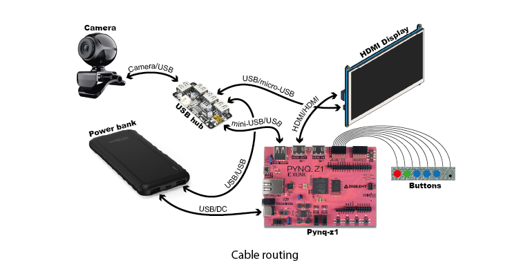

# Readme Box

## Necessary Materials

**Components :**

- MDF 3mm and plexiglass 3mm plates
- Pynq-z1 : [Pynq-z1 Reference](https://digilent.com/reference/programmable-logic/pynq-z1/start)
- Adafruit HDMI 5” display, 800x480p : [Adafruit HDMI Display](https://www.adafruit.com/product/2232)
- Hub 4 USB ZERO4U v1.3 : [USB Hub](https://www.adafruit.com/product/4115)
- 10000mAh power bank : [Power Bank](https://docs.rs-online.com/7d7a/A700000008361745.pdf)
- Buttons : [Buttons](https://www.adafruit.com/product/1009)
- Resistors 10K ohm : [10K Resistors](https://www.adafruit.com/product/2784)
- Prototyping PCB : [Prototyping PCB](https://www.amazon.fr/DollaTek-Panneau-Universel-Bricolage-Soudure/dp/B07DK52YK5/ref=sr_1_13?keywords=PCB+Prototype&qid=1690555935&sr=8-13)
- A low-resolution camera, such as a Logitech webcam
- Spacers, screws, bolts, and washers of 3mm

**Cables :**

- 1 USB male-male 0.2m
- 1 USB/mini-USB 0.3m
- 1 USB/micro-USB 0.3m
- 1 HDMI male-male 0.2m
- 1 USB/DC
- 8 jumper wires male-male

It is recommended to use angled cables, especially for the USB/mini-USB connected to the Pynq-z1, for the HDMI cable, and the 2 USB ports connected to the power bank (USB/USB and USB/DC).

## Laser Cutting
All the box's structure is cut using a laser cutter.

### Internal Structure (MDF)
The **internal structure** is made from MDF and consists of 3 parts : the bottom containing the power bank and USB hub, the middle housing the Pynq-z1, and the top holding the screen and the PCB with buttons. These 3 parts should be cut from 3mm MDF.

The honeycomb shapes are for aesthetics but also aid in cable routing and heat dissipation. Some holes are pre-drilled, while others need a 3mm bit to drill. Refer to the existing box for guidance.

SVG files are located in the **"LaserCutting"** folder.

### Top and Sides (Plexiglass)
The **top and sides** are made of plexiglass and consist of the assembly of 3 different parts. All holes are pre-drilled, though adjustments may be needed for the screen holes on the top. **Be cautious when handling plexiglass** due to its fragility, **especially the accordion parts** forming the rounded corners.

**Warning :** Text and logos on the top **should be engraved**.

SVG files are located in the **“LaserCutting”** folder. You have a choice between 2 files, depending on the shape of the plexiglass plate. However, once you choose a file, stick with it for all 3 parts (top and 2 sides).

If plexiglass is unavailable, you can also use MDF.

### 3D Printed Parts
The **3D printed parts** can be printed on any 3D printer. In this project, we use the Ultimaker 2+ with blue PLA. 3MF files are available in the **“3DPrinting”** folder.

### Other Details
**Some parts vary from the existing demo** due to corrections made from previous mistakes in the V1 version.

**Spacers, screws, bolts, and washers of 3mm** have been used.

## Internal Structure (MDF)

Before drilling all holes, it's recommended to **assemble all components with cables** on the MDF plates to ensure a proper fit. Ensure components are oriented correctly, especially the Pynq-z1 and the screen. Verify that **cables do not protrude** from the sides; if they do, consider shortening them with a cutter.

**Bottom (Power Bank and USB Hub):**
- Add spacers under the hub. Place it so that the external USB port for the camera is **flush with the edge** of the plate. It must also align with the hole in the plexiglass side. Use the pre-cut hole in the plexiglass part or measure from the SVG file.
- Position the power bank **next to the USB hub and corner spacer**.
- Place components and supports, then mark and drill the holes.
- Attach components with screws.

**Middle (Pynq-z1):**
- Place the Pynq-z1 and supports, mark and drill the holes. Before drilling, **ensure the Pynq-z1 is properly positioned**, verify especially that the HDMI port and the USB port **are not protruding from the sides when plugged in.**
- **Add bolts under supports for better fixation.**
- Secure the Pynq-z1 with supports.

**Top (Screen and Buttons):**
- Add spacers under the screen.
- Place the screen in the **center of the MDF plate**. It's very important to **ensure the screen is properly positioned** before drilling. The screen should be **centered** on the plate, with the HDMI port **not protruding** from the side. The screen should also be **centered** on the plexiglass top. Use the pre-cut hole in the plexiglass part or measure from the SVG file. Then mark and drill the holes.
- **Assemble the buttons, resistors and wires on a PCB**, respecting button spacing (1 hole between button legs) to align with the holes on the top of the box. Refer to the electrical diagram.
- Drill holes on the PCB to match the button holes on the top of the box.
- Bolts may be required under the PCB to prevent damage to the solder joints.
- Attach components to the plate.

**After assembling components on the plates**, you can start assembling the plates together.

**Use spacers** to attach the Pynq plate to the power bank plate. The Pynq plate should not touch the other. Then, attach the screen plate on top of the Pynq plate using spacers. **With these 3 parts secured**, start routing cables **following the diagram**, using honeycomb shapes as guides. **You will need to cut honeycomb shapes** to accommodate the various cables.

**Short cables are easier to work with**. If not, use the space near the power bank and USB hub to bundle longer cables. Prevent protruding cables with spacers and secure with threads if needed. If you lack a DC/USB cable, solder a DC part to a USB part, using only the power segment of the USB cable.

**Angled cables are recommended**, else some cables may need to be cut to avoid protrusion.

With the internal structure assembled and cables secured, you can attach the plexiglass top and sides.

## Top and Sides (Plexiglass)

Before assembly, **ensure all cables are properly cut and positioned**, especially the holes for the camera and power bank.

Start by assembling two side parts. **Confirm their orientation before assembly**, as separating them later risks breaking them. Plexiglass is fragile; handle with care to avoid cracks or breaks.

Assemble the top onto the sides. Be cautious with the top's orientation. **Buttons should be above the USB-C hole (power bank), not the USB hole (camera)**. Engravings should also face up. This step requires a bit of pulling due to the accordion parts' flexibility, but care to prevent damage to the plexiglass.

## Assembly of All Parts

Finally, **assemble the box by sliding the plexiglass part onto the MDF part**.

Start by **unscrewing the screen**. Slide the plexiglass part over the first plate; halfway done. Some cables may obstruct, so push or gently maneuver them.

**The screen won't be fixed**; carefully place it on top of spacers as you slide the plexiglass. This requires a steady hand.

When the plexiglass is fully in place, with the screen and buttons aligned, **screw the top to the screen**. **Use plastic washers** to prevent cracks in the plexiglass, and do not overtighten.

**Et voilà !**

## Usage

For SD card or Ethernet access, **remove the top by unscrewing the screen and sliding the plexiglass in the opposite direction**.

Generally, **you don't need to keep the top always on**. Using only the bottom and middle parts offers easier access to the Pynq-z1. **In this setup, securely screw the screen onto the spacers to prevent damage**.

When you're not using the Pynq, **leave it plugged in via USB-C and press the** `quit` **button** (small black button on the right).
In this setup, the Pynq will be powered on but no program will be running.

To restart the demo, simply **unplug it**, which will automatically reboot the Pynq (likely due to a voltage drop).

## Nota

- When you **remove the camera**, you may have to reconnect the camera twice. This bug probably comes from the usb hub.
- When you **connect the battery** with ucb-c, the demo still works, but **when you disconnect it, it reboots** (likely due to a voltage drop).