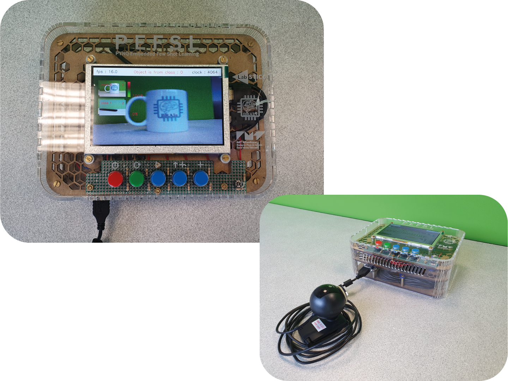
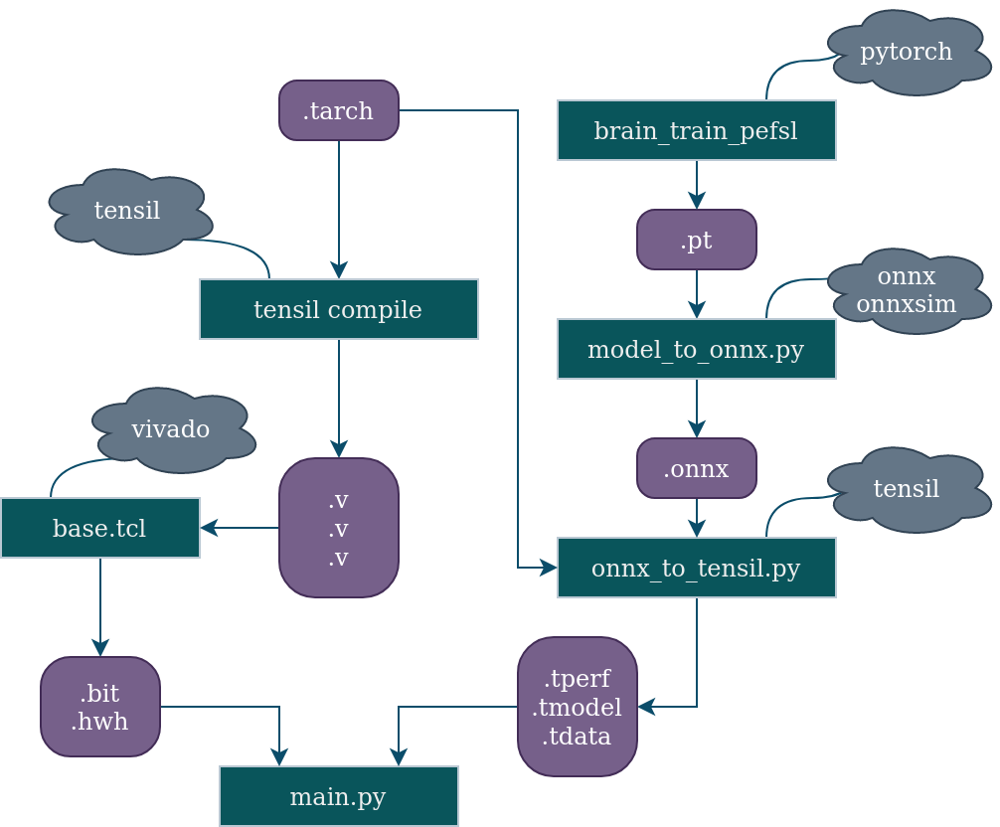
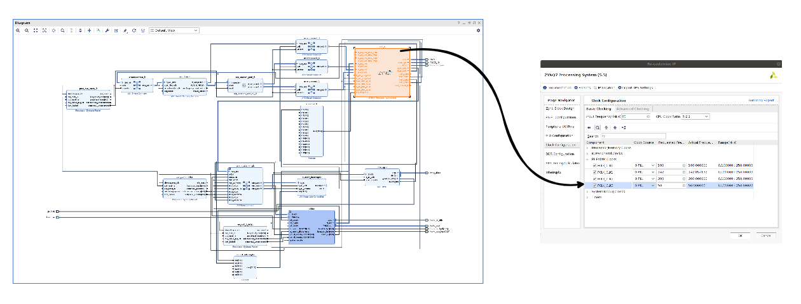

# PEFSL : A Pipeline for Embedded Few-Shot Learning


**[News] 🥳 🎉 🥇 PEFSL won the [Xilinx Open Hardware Competition](https://www.openhw.eu/2023-results-gallery) in the Student AI Track! 🥇 🎉 🥳**

This repository contains the code to perform online Few shot Learning with a webcam on FPGA using the [Tensil](https://tensil.ai) framework on the [PYNQ-Z1](http://www.pynq.io/). It also contains the code to evaluate the performance of the network on the dataset cifar-10. Models and algorithms are based on the [EASY paper](https://arxiv.org/abs/2201.09699).

## This is what it looks like:
A video of the demonstrator is available [here](https://www.youtube.com/watch?v=JPZgkxYSdg0).



There are two steps in the demonstration :
- First you need to take few shots of the classes you want to recognize
- Then you can start the inference

Simple as that !

This is how to use the buttons :

```
Button 0 : take a shot with current class
Button 1 : switch to the next class and take a shot of this class
Button 2 : start inference
Button 3 : reset the demo
Button 4 : pause the demo
Button 5 : quit the demo
```
If you don't build the box and don't map the buttons, you can use the pynq's buttons to interact with the demo, but therefore you will only be able to use the first 4 features.

If you use a keyboard, you can use all the buttons, but only the numbers on top of the keyboard (not the numeric keypad).

# How to install and run the demo on the PYNQ board

## Requirements
- PYNQ-Z1
- Webcam USB
- HDMI screen and cable
- Ethernet cable
- SD card (at least 8GB)
- Micro-USB cable

## Installation
1. Download the [PYNQ-Z1 v2.7 image](https://bit.ly/pynqz1_2_7) and [flash it on the SD card](https://pynq.readthedocs.io/en/v2.7.0/appendix/sdcard.html?highlight=SD%20card#writing-an-sd-card-image) and [get started](https://pynq.readthedocs.io/en/v2.7.0/getting_started/pynq_z1_setup.html).
2. Install tensil tcu on the PYNQ: Start by cloning the [Tensil GitHub repository](https://github.com/tensil-ai/tensil) to your work station and then copy `drivers/tcu_pynq` to `/home/xilinx/tcu_pynq` onto your board.
    ```bash
    git clone git@github.com:tensil-ai/tensil.git
    scp -r tensil/drivers/tcu_pynq xilinx@192.168.2.99:
    ```
3. Copy the hardware (bitstream & metadata) and the tensil model files on the PYNQ. Demo files are available [on this link](https://drive.google.com/file/d/1u2a_PXEhzabauGSO_mkPQRekgvphM5L8/view?usp=sharing).
4. Clone or copy this repository on the PYNQ.

## Python libraries

All the libraries you need to run the demo are listed in `requirements.txt`. To install all of them, execute the following command :

```bash
pip install -r requirements.txt
```

## Run the demo
1. Connect the PYNQ to the screen and the webcam.
2. Launch the demo as sudo with environment variables set :

    ```bash
    sudo -E python3 main.py --framework tensil --backbone resnet9 --path-tmodel ../resnet9_strided_16fmaps_onnx_custom_perf.tmodel --path-bit ../design.bit --hdmi-display --button pynq --camera-resolution 160x120 --output-resolution 800x480
    ```
3. The demo should be running now on the HDMI screen. You can use the buttons on the PYNQ to interact with the demo as described above.


# How to install and run the demo on your computer
It is also possible to run the demo on your computer using pytorch. Example weights are also available [on this link](https://drive.google.com/file/d/1u2a_PXEhzabauGSO_mkPQRekgvphM5L8/view?usp=sharing) under the name `resnet9_strided_16fmaps.pt` :
```bash
python3 main.py --framework pytorch --device-pytorch cpu --backbone resnet9 --path-pytorch-weight ../resnet9_strided_16fmaps.pt --button keyboard --camera-resolution 160x120 --output-resolution 800x480
```

The inputs are the following : {1-4} to register shots for classes {0-3}, i to start inference, r to reset the demo, p to pause the demo, q to quit.
Warning : this was coded with an AZERTY keyboard, and you have to use numbers on top of the keyboard (not the numeric keypad).

# How to train a model, convert it to onnx, then to tensil and finally run it on the PYNQ
## Schema of the process



## How to train a backbone model
A repository is available to train a model with pytorch : https://github.com/antoine-lavrard/brain-train/tree/few_shot_demo. It is possible to train a model from scratch.

## Conversion to onnx

The script used to convert the model to onnx is [model_to_onnx.py](model_to_onnx.py). Examples to export backbone from other repository is available in the documentation of the file. In order to be exported with this script, the networks must be a resnet9 or resnet12. Here is an example to convert a strided resnet9 into onnx file :
```bash
python3 model_to_onnx.py --input-resolution 32 --backbone resnet9 --input-model ../resnet9_strided_16fmaps.pt --save-name resnet9_strided_16fmaps --use-strides
```
Weights available [on this link](https://drive.google.com/drive/folders/1ftzFL3Byidmls2zS0OdhVA2FBBb2krQR?usp=share_link).

## Conversion to tensil
Once you generated the onnx file for your model, you can generate the tensil model using the script [onnx_to_tensil.py](onnx_to_tensil.py) :
```bash
python3 onnx_to_tensil.py --onnx-path resnet9_strided_16fmaps.onnx --arch-path arch/custom_perf.tarch --output-dir tensil/
```

Docker need to be installed, as well as [docker tensil image](https://hub.docker.com/r/tensilai/tensil). Compilation may take some time (5min on AMD ryzen 5 3350H for the smaller network). All the infos of the compilation and rtl files generation of the network are saved into txt files. For a broad overview, checkout the COMPILER SUMMARY at the end of the file.


# Hardware vivado project
The project has been created with Vivado 2020.2. The project is available in the folder `vivado_project`. The project is configured for the PYNQ-Z1 board. The board files can be found in the directory `vivado_project/pynq-z1`. Add them to Vivado by copying it to the directory `Vivado/2020.2/data/boards/board_files`.

Use the tcl script `vivado_project/base.tcl` to generate the project.
```bash
vivado -mode batch -source base.tcl
```

You can then open the project with Vivado and generate the bitstream.

If you want to modify the tensil architecture, replace the verilog files that are in the `vivado_project/base/sources_1/imports/tensil` folder with the ones that you generate with tensil. Then, regenerate the project with the tcl script.

In this configuration, the clock is set to 50MHz, but you can increase it to 125MHz maximum following this diagram :



You will have a negative WLS (Worst Negative Slack), but you will gain 3fps during inference.

The output files that you will need after the bitstream generation are the following:
- `vivado_project/base/base.runs/impl_1/base_wrapper.bit`
- `vivado_project/base/base.gen/sources_1/bd/base/hw_handoff/base.hwh`

Rename them to respectively to `design.bit` and `design.hwh` and copy them to the PYNQ.

You can also execute the script `get_output_files.sh` to extract and rename them directly.

# Possible pitfalls :
    - Sometimes there is a bug with memory allocation (an error is raised). We are investigating it. For now if it happens, just reset the PYNQ.
    - In the PYNQ, always launch the scripts using sudo -E.
    - When launching the model, if the tarch used when compiling the model does not correspond to the accelerator, the scripts fail silently.
    - If you are running the demo on your computer and encounter a black screen with the message "Can't find a camera. Please do a reset (green button)" despite having a camera connected and available, increase the camera resolution. This issue may occur because your camera does not support such a low resolution.
